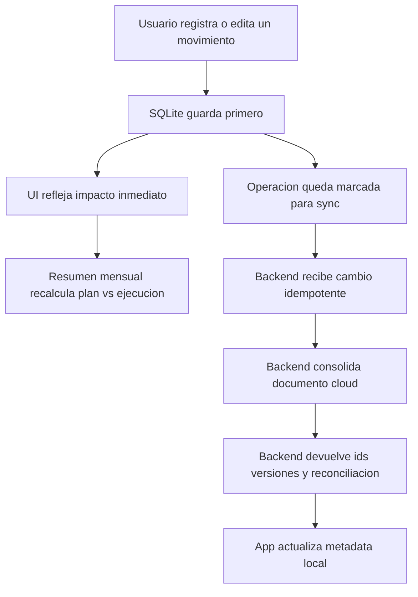

# Backend readiness para finanzas personales

## Objetivo

Este documento funciona como puente entre:

- la arquitectura local actual del repo
- el enfoque funcional del MVP 1
- la futura necesidad de backend, sync y captura conversacional

No define un backend ya implementado. Define que debe respetar cuando se empiece a construir.

## Punto de partida real

Hoy ProsferApp es:

- una app mobile Expo / React Native
- local-first y offline-first
- persistida en SQLite
- organizada por dominios bajo `src/features/`
- con el backend aun fuera de este repo

Referencias reales:

- `docs/project-context.md`
- `docs/data-architecture.md`
- `docs/mvp1-activity-capture-plan-tracking.md`
- `src/database/`
- `src/features/personal-finance/`
- `src/features/notifications/`

## Regla principal

El backend no debe redefinir el producto. Debe amplificar lo que ya funciona localmente:

- captura de actividad
- seguimiento plan vs ejecucion
- claridad sobre desvio
- continuidad de uso

Por eso, la primera arquitectura backend debe ser:

- sync-friendly
- idempotente
- modular
- alineada con ownership y metadata local ya existentes

## Que rol debe tener el backend en su primera etapa

El backend deberia resolver primero:

- identidad y cuenta cloud del usuario
- backup y restauracion
- sincronizacion entre dispositivos
- persistencia canonical en nube
- soporte para futuras notificaciones orquestadas
- soporte para futura captura conversacional

No deberia intentar primero:

- mover toda la logica de producto fuera de la app
- volver dependiente de red el flujo principal
- reemplazar el calculo local del mes
- convertir el chatbot en el centro del sistema

## Arquitectura sugerida a nivel de capacidades

La capa backend futura deberia separarse por modulos o bounded contexts parecidos a los dominios actuales:

1. `identity`
   - usuarios
   - perfiles
   - preferencias globales
2. `personal-finance`
   - wallets
   - categories
   - transactions
   - budgets
   - budget income items
   - debts
   - goals
   - goal contributions
   - budget preferences
3. `sync`
   - recepcion de cambios
   - versionado
   - reconciliacion
   - cola y auditoria de cambios
4. `notifications`
   - reglas futuras
   - delivery orchestration
   - preferencias de canal
5. `conversational-capture`
   - interpretacion de mensajes
   - borradores
   - confirmacion
   - escritura sobre contratos ya existentes

## Entidades minimas que el backend debe entender

### Entidades base

- `users`
- `personal_profiles`
- `app_settings` o su equivalente cloud

### Entidades financieras

- `wallets`
- `categories`
- `transactions`
- `budgets`
- `budget_categories`
- `budget_income_items`
- `debts`
- `goals`
- `goal_contributions`
- `budget_preferences`

### Metadata obligatoria que ya existe o debe preservarse

- `local_id`
- `server_id`
- `sync_status`
- `version`
- `created_at`
- `updated_at`
- `deleted_at`
- `owner_type`
- `owner_local_id`

## Campos que conviene dejar preparados para la fase backend y conversacional

Aunque algunos aun no esten completos en schema, conviene que el contrato objetivo contemple:

- `source_channel`
  - `manual_app`
  - `chatbot`
  - `automation`
  - `suggestion_confirmed`
- `confirmation_status`
  - `confirmed`
  - `pending`
  - `rejected`
- `occurred_at`
- `captured_at`
- `edited_after_creation`
- `draft_state` para movimientos incompletos o pendientes
- `confidence_score` cuando el movimiento venga de una inferencia futura

Regla:

- estos campos pueden aparecer por etapas
- no deben bloquear el MVP actual
- si se agregan, deben ser aditivos y compatibles con SQLite local

## Contrato funcional que el backend debe respetar

La unidad de valor no es la transaccion aislada. Es la relacion entre:

- plan del mes
- actividad real
- desvio
- alertas e insights

Por eso, el backend debe permitir reconstruir:

- ingresos totales
- egresos totales
- gasto esencial
- gasto no esencial
- pagos de deuda
- aportes a metas
- ahorro esperado vs real
- desvio por categoria
- estado del plan mensual

El backend puede calcular snapshots o analytics mas adelante, pero no debe impedir que la app siga derivando esto localmente.

## Estrategia de integracion recomendada

### Fase 1: backend de persistencia y sync

Objetivo:

- tener cuenta cloud
- subir y bajar datos
- soportar multi-dispositivo
- mantener la app util aun sin internet

Caracteristicas:

- la app sigue escribiendo local primero
- la nube recibe cambios de forma asincronica
- el servidor responde con `server_id`, versiones y reconciliacion

### Fase 2: backend de valor agregado

Objetivo:

- notificaciones orquestadas
- recordatorios inteligentes
- ingestion conversacional
- reportes o analitica de mayor escala

Caracteristicas:

- usa los mismos contratos del dominio financiero
- no crea una segunda semantica distinta de transaccion

## Flujo recomendado de escritura y sync

## Requisitos tecnicos clave para el futuro backend

### 1. Idempotencia

Los endpoints de escritura deben tolerar reintentos sin duplicar movimientos.

### 2. Versionado

Cada entidad sincronizable debe poder reconciliar cambios locales y cloud.

### 3. Soft delete

Los borrados deben seguir la semantica ya existente con `deleted_at`.

### 4. Ownership

La capa cloud debe preservar `owner_type` y `owner_local_id` o sus equivalentes canonicos para no mezclar contextos personales y de negocio.

### 5. Contratos separados por dominio

No concentrar todo en un solo endpoint gigante tipo `saveEverything`.

### 6. Compatibilidad offline

La falta de red no debe romper:

- registro
- lectura del plan
- seguimiento del mes
- alertas locales

## MongoDB Atlas como direccion cloud

La documentacion actual ya fija MongoDB Atlas como direccion futura.

Regla para esa transicion:

- usar MongoDB Atlas como fuente canonical cloud
- mantener `server_id` como enlace entre SQLite y nube
- definir un contrato de mapeo SQLite <-> cloud antes de abrir sync compleja

Esto no obliga todavia a decidir:

- framework exacto del backend
- proveedor de autenticacion
- broker de eventos
- motor de colas

Esas decisiones deben tomarse cuando el alcance de fase 1 backend este bien delimitado.

## Relacion con proximas capacidades

### React tour

- queda del lado frontend
- no debe contaminar el modelo backend

### Notificaciones

- puede empezar localmente
- despues puede recibir apoyo cloud para recordatorios, digest y reengagement

### Modulo de datos personales

- si impacta identidad, perfil o preferencias, conviene pensarlo ya como entidad sincronizable

### Preferencias

- distinguir entre:
  - preferencias de presupuesto
  - preferencias de notificaciones
  - preferencias de experiencia

### Chatbot

- no debe escribir por fuera del dominio financiero
- debe usar los mismos contratos de transaccion, deuda, meta y transferencia

## Backlog recomendado antes de construir el backend

1. cerrar un diccionario de entidades y campos del dominio financiero
2. documentar contrato de sync SQLite <-> cloud
3. definir que campos nuevos se agregaran primero para trazabilidad y origen
4. separar claramente preferencias de presupuesto vs preferencias generales
5. definir alcance de fase 1 backend
6. definir alcance de chatbot fase 1 solo para captura

## Conclusiones

ProsferApp ya tiene una base local suficientemente clara como para empezar a pensar un backend.

La condicion es no romper estas reglas:

- local-first
- offline-first
- plan vs ejecucion como centro del producto
- contratos de dominio claros
- crecimiento modular

Si el backend respeta eso, despues sera mucho mas facil sumar:

- multi-dispositivo
- backup
- notificaciones
- datos personales y preferencias sincronizadas
- captura conversacional
- automatizaciones parciales futuras
