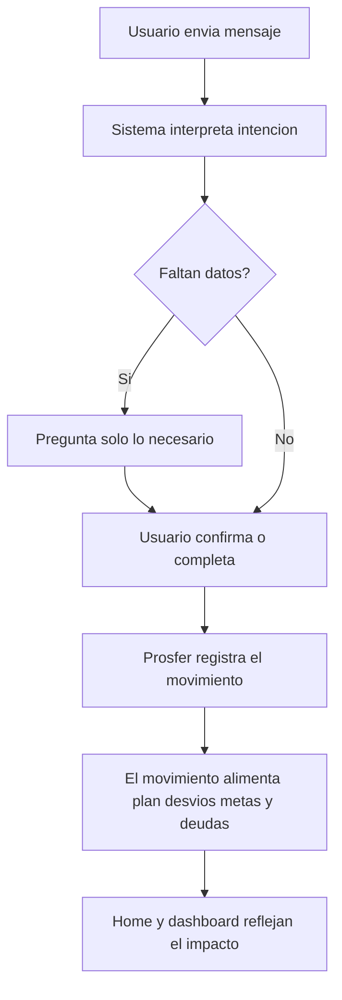

# MVP 1 captura de actividad y seguimiento del plan

## Proposito

Este documento aterriza el enfoque funcional actual de ProsferApp para el MVP 1.

La prioridad no es automatizar por completo las finanzas del usuario. La prioridad es lograr que registrar actividad financiera y entender el mes sea lo bastante simple, util y constante como para generar habito, contexto y datos de valor.

ProsferApp no debe quedarse en "anotar gastos". Debe ayudar al usuario a:

- entender que se propuso hacer
- ver que esta haciendo realmente
- detectar desvios a tiempo
- recibir avisos utiles
- tomar mejores decisiones
- sostener habitos financieros con baja friccion

## Contexto real del repo

Este enfoque se apoya en la base ya existente del proyecto:

- app mobile con Expo y React Native
- TypeScript
- SQLite local con enfoque offline-first
- modulos por dominio bajo `src/features/`
- presupuesto mensual, wallets, categorias, transacciones, deudas, metas y alertas locales ya modeladas

Referencias concretas:

- `docs/objective.md`
- `docs/project-context.md`
- `docs/data-architecture.md`
- `docs/mvp-roadmap.md`
- `src/features/personal-finance/`
- `src/database/schema/004_budget_planning.ts`
- `src/database/schema/005_budget_feature_expansion.ts`
- `src/database/schema/006_budget_section_planning.ts`
- `src/database/schema/007_editable_essential_defaults.ts`

## Tesis de producto para esta etapa

La tesis del MVP 1 puede resumirse asi:

> ProsferApp ayuda al usuario a sostener su plan financiero personal mostrandole, de manera simple y accionable, la diferencia entre lo que queria hacer y lo que realmente hizo.

Consecuencia operativa:

> El valor del producto depende de que registrar actividad sea lo bastante facil como para que el usuario no abandone.

## Corazon real del MVP

La base conceptual del producto ya no es solo "registro de movimientos".

Hoy el corazon del MVP es:

- comparacion entre plan y ejecucion
- lectura de desvio por bloque y por categoria
- accion correctiva antes de romper el mes

El problema principal ya no es la falta de funciones. El problema principal es la friccion de uso.

Si registrar sigue siendo costoso, la constancia cae. Si la constancia cae, el analisis pierde calidad. Por eso el siguiente paso logico no es abrir muchas pantallas nuevas, sino facilitar captura sin perder estructura.

## Problema real que se esta resolviendo

El usuario no necesita solo saber cuanto entra y cuanto sale. Necesita responder preguntas como:

- estoy haciendo lo que me propuse este mes
- en que me estoy desviando
- falle por un gasto puntual o por un patron
- mis esenciales me estan dejando sin margen
- estoy avanzando hacia mis metas o solo sobreviviendo el mes
- mis decisiones reales coinciden con mi intencion financiera

ProsferApp agrega valor cuando convierte actividad financiera en claridad util.

## Utilidad que debe entregar el producto

### Utilidad operativa

Debe permitir registrar y ordenar informacion sin friccion excesiva.

Incluye:

- registrar ingresos
- registrar egresos
- saber desde que wallet salio o a cual entro
- distinguir esencial y no esencial
- registrar deuda y meta
- corregir errores sin friccion

### Utilidad analitica

Debe permitir comparar plan contra realidad de forma entendible.

Incluye:

- cuanto se habia presupuestado
- cuanto se gasto o ingreso realmente
- cuanto se desvio
- en que categorias se desvia mas
- si el ingreso sostiene la estructura actual
- cuanto margen queda

### Utilidad conductual

Debe ayudar al usuario a actuar mejor.

Incluye:

- avisar antes de romper el plan
- detectar patrones de riesgo
- mostrar progreso real en metas
- reforzar habitos positivos
- sugerir ajustes concretos basados en datos

## Datos minimos por movimiento

Cada movimiento financiero deberia poder capturar o derivar idealmente:

- tipo de movimiento:
  - ingreso
  - egreso
  - transferencia
  - pago de deuda
  - aporte a meta
- monto
- moneda
- fecha
- wallet origen
- wallet destino si aplica
- categoria
- subcategoria si mas adelante se incorpora
- indicador de esencial o no esencial
- descripcion o nota
- fuente de creacion:
  - manual app
  - chatbot
  - automatizacion futura
- nivel de confianza o confirmacion cuando provenga de sugerencia futura

## Datos agregados que importan para el analisis

A nivel mensual o por periodo ProsferApp debe derivar:

- ingresos totales
- egresos totales
- gasto esencial total
- gasto no esencial total
- ahorro real
- ahorro planificado
- diferencia entre ahorro esperado y real
- total destinado a deudas
- total destinado a metas
- margen restante
- porcentaje del presupuesto consumido
- categorias con mayor desvio
- dias con registro y dias sin registro
- frecuencia de carga

## Datos conductuales relevantes

Estos datos pueden volverse diferenciales en una fase posterior:

- cuanto tarda el usuario en registrar movimientos
- cuantos registros corrige
- que categorias usa mas
- que tipo de gasto suele omitir
- cuando aparece el descontrol del mes
- si el desvio viene por una categoria puntual o por acumulacion
- si el usuario reacciona a alertas
- si mantiene constancia semanal

## Avisos e insights que si agregan valor

Los avisos deben ser concretos, comprensibles y accionables.

### Desvio leve

Cuando el usuario empieza a alejarse del plan pero todavia puede corregir.

Ejemplo:

- "Este mes ya llevas un 68% del presupuesto de comida y aun faltan 14 dias."

### Desvio grave

Cuando ya rompio el marco que se habia propuesto.

Ejemplo:

- "Ya superaste el presupuesto de salidas. Conviene revisar esta categoria para evitar afectar tus metas."

### Riesgo sobre metas

Ejemplo:

- "Con el ritmo actual, este mes no alcanzarias el aporte previsto para tu meta de emergencia."

### Riesgo por deudas

Ejemplo:

- "Todavia no registraste el pago de una deuda planificada para este periodo."

### Falta de registro

Ejemplo:

- "Hace varios dias no registras actividad. Actualizar tus movimientos te ayudara a ver si sigues dentro del plan."

### Refuerzo positivo

Ejemplo:

- "Vas bien: mantienes tus gastos esenciales dentro de lo esperado esta semana."

### Regla de calidad para consejos

Los consejos deben apoyarse en datos reales del usuario.

Evitar:

- mensajes moralistas
- mensajes vagos
- mensajes repetitivos
- consejos sin accion posible

## Estadisticas importantes en el MVP

Las estadisticas deben responder rapido que tan bien esta sosteniendo el usuario su plan.

### Estadisticas principales

- cumplimiento del plan mensual
- distribucion de gastos entre esenciales, no esenciales, deudas y metas
- evolucion del mes
- desvio por categoria
- ahorro esperado vs ahorro real
- estado de metas

### Estadisticas de comportamiento valiosas a futuro

- constancia de registro
- dias con actividad registrada
- promedio semanal de gasto
- categoria mas inestable
- porcentaje del ingreso comprometido en esenciales
- porcentaje del ingreso comprometido en deudas
- tendencia mensual de desvio

## Principios UX del MVP

La experiencia debe asumir que registrar actividad cuesta.

Por eso la UX debe priorizar:

- registrar rapido
- corregir facil
- mostrar lo importante primero
- hacer visible la utilidad del dato cargado
- priorizar continuidad por sobre perfeccion absoluta

## Rol del chatbot dentro de esta vision

El chatbot no aparece como una feature aislada. Aparece como respuesta al principal cuello de botella del MVP: la friccion para registrar actividad.

La app sigue siendo el centro de:

- resumen
- analisis
- correccion
- configuracion
- estadisticas
- ajustes del plan

El bot aparece como canal de captura.

### Funcion principal del chatbot

Permitir que el usuario registre movimientos de forma natural y rapida sin entrar siempre a la app.

### Que debe lograr

- reducir abandono del registro
- convertir el registro en una interaccion cotidiana
- captar movimientos con menos esfuerzo
- mantener trazabilidad y estructura
- alimentar el motor analitico ya existente

### Que no debe intentar resolver al inicio

- reemplazar la app
- responder cualquier pregunta compleja
- actuar como asesor financiero total
- inferir demasiado sin confirmacion
- automatizar movimientos criticos sin validacion

## Flujo conceptual de captura conversacional futura

## Casos de uso prioritarios para integracion conversacional

Los primeros casos de uso del bot deben ser pocos y claros:

1. registrar egreso
2. registrar ingreso
3. registrar pago de deuda
4. registrar aporte a meta
5. registrar transferencia entre wallets
6. consultar resumen corto despues de que el registro este muy bien resuelto

Ejemplos de mensajes viables:

- "Gaste 12000 en comida"
- "Me entraron 250000"
- "Pague una deuda de 40000"
- "Puse 15000 en mi meta de ahorro"
- "Gaste 8000 en transporte desde Mercado Pago"

## Datos y decisiones que conviene dejar preparados desde ahora

Aunque el chatbot no se implemente ya, conviene preparar:

- fuente del movimiento
- trazabilidad de creacion y edicion
- confirmacion del usuario
- estructura consistente de categorias y wallets
- capacidad de manejar borradores o movimientos pendientes de confirmacion

Esto no implica implementar ya toda la automatizacion. Implica no cerrar el modelo de datos de manera que despues obligue a rehacerlo.

## Relacion con las proximas capacidades

Despues de consolidar este enfoque, las siguientes capacidades pueden entrar de forma ordenada:

- modulo de datos personales del usuario
- preferencias mas ricas
- notificaciones
- react tour o guia inicial de onboarding contextual
- captura conversacional fase 1

Regla:

- estas capacidades deben apoyar captura, entendimiento y continuidad
- no deben contaminar el MVP con complejidad que todavia no aporta valor

## Conclusiones operativas

La utilidad real de ProsferApp en esta etapa esta en ayudar al usuario a sostener un plan financiero personal a partir de:

- registros simples
- estadisticas claras
- avisos utiles
- contexto accionable

La gran oportunidad inmediata no es tener mas features. Es:

- reducir la friccion de registrar
- mejorar la lectura de lo que pasa
- construir habito
- preparar la futura captura conversacional sin desordenar el modelo actual
