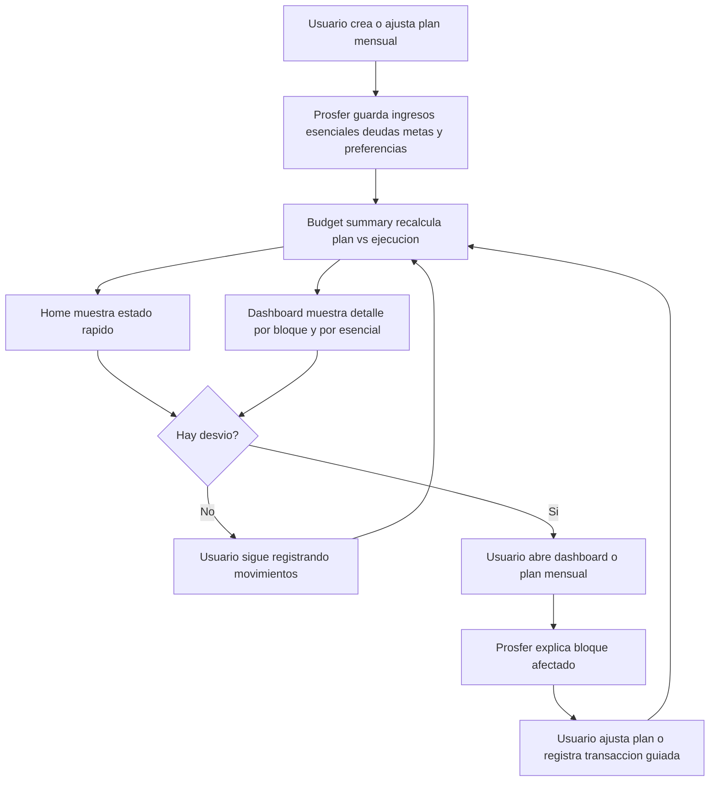
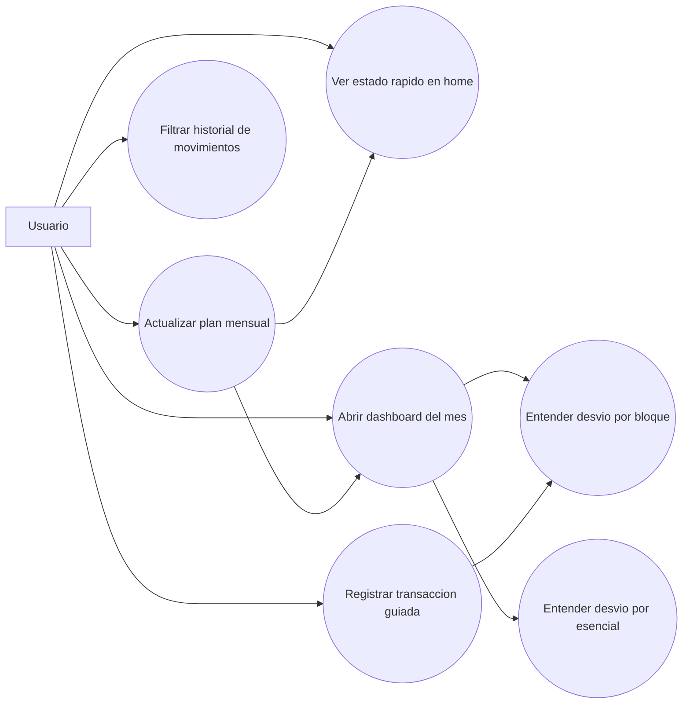

# Dashboard y monitoreo del plan mensual

## Objetivo

El home y el dashboard deben contar la misma historia del mes.

La diferencia entre ambos no es la logica, sino el nivel de profundidad:

- `home` da una lectura rapida, alertas y accesos de accion
- `dashboard` explica con mas detalle donde se produjo un desvio y como se reparte el mes

## Fuente de verdad

Ambas pantallas consumen el mismo resumen derivado:

- `budgetSummaryService.getCurrentMonthlyBudgetOverview`

Archivos clave:

- `src/features/personal-finance/services/budget-summary.service.ts`
- `src/features/personal-finance/hooks/use-home-screen.ts`
- `src/features/personal-finance/hooks/use-dashboard-screen.ts`

## Regla de consistencia

La lectura de estado del plan sigue estas reglas:

- `off_track`: cuando esenciales o flexible superan lo planificado
- `warning`: cuando deudas o metas van por debajo del objetivo mensual
- `on_track`: cuando no hay exceso en caps ni faltantes en targets

Regla UX:

- nunca mostrar "te quedan {{amount}} antes de salirte del plan" si el estado ya es `off_track`
- cuando el desvio ya ocurrio, la lectura rapida debe decir en que bloque paso
- el dashboard debe usar el mismo estado que home y solo profundizar el por que

## Lectura de los graficos

### Dona de esenciales

- muestra la distribucion real por categoria esencial
- si aun no hay movimientos reales, toma el plan como referencia
- el centro muestra el total actualmente visualizado
- el detalle inferior confirma categoria, monto, porcentaje y desvio

### Dona de bloques

- compara como se reparte el mes entre esenciales, deudas, metas y flexible
- si todavia no hay ejecucion real, usa los montos planificados
- ayuda a ver rapido si el mes esta cargado en gasto base, deuda, ahorro o margen libre

## Diagrama de flujo

## Diagrama de casos de uso

## Checklist de mantenimiento

- si cambia la logica de `deviation_status`, actualizar home y dashboard en el mismo cambio
- si cambia un grafico, revisar tambien los textos que explican ese grafico
- si se agregan nuevos bloques al plan, actualizar:
  - `BudgetComparisonBlock`
  - summary service
  - dashboard
  - documentacion de este archivo
- si aparece un nuevo flujo guiado, reflejarlo en los diagramas
